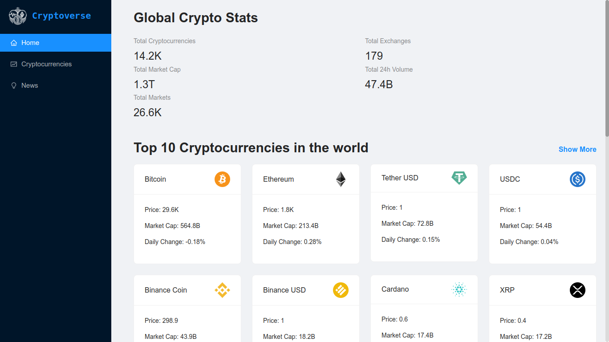

<div id="top"></div>

<!-- PROJECT LOGO -->
<div align="center">
  

  <br />

  <h1 align="center">CryptoVerse</h1>

  <p align="center">
    Get to know the latest trends of Cryptocurrencies around the Globe. Visualize entire growth of different CryptoCoins through Graphs.
    <br />
    <br />
    <a href="https://cryptoversereact.vercel.app/">View the Product live</a>
  </p>
</div>

<!-- TABLE OF CONTENTS -->
<details>
  <summary>Table of Contents</summary>
  <ol>
    <li>
      <a href="#a-glimpse-on-the-project">A Glimpse on the Project</a>
      <ul>
        <li><a href="#built-with">Built With</a></li>
      </ul>
    </li>
    <li>
      <a href="#getting-started">Getting Started</a>
      <ul>
        <li><a href="#prerequisites">Prerequisites</a></li>
        <li><a href="#installation">Installation</a></li>
      </ul>
    </li>
    <li><a href="#contact">Contact</a></li>
    <li><a href="#acknowledgments">Acknowledgments</a></li>
  </ol>
</details>

<br/>

<!-- ABOUT THE PROJECT -->

## A Glimpse on the Project



## Built With

This project was built with many tools. Here are a some of them to mention:

- [React.js](https://reactjs.org/)
- [Redux-Toolkit](https://redux-toolkit.js.org/)
- [React Chart.js 2](https://react-chartjs-2.js.org/)
- [Ant Design](https://ant.design/)

<!-- GETTING STARTED -->

## Getting Started

Eager to build a Crypto News React App by taking inspiration from this repository? Well follow through the steps. Stay patient, work hard enough and you'll reach the end successfully. You can take the project from here to a totally different direction of your own if you want to by adding different functionalities if you want to.

### Prerequisites

You must have these requirements filled before moving on to building this project on your local machine.

- Node JS
- npm or yarn or pnpm
- CoinRanking and Bing news Api access keys at [RapidAPI](https://rapidapi.com/) for free

### Installation

_Below is an example of how you can follow through this repository and build your own CryptoNews App and hopefully add a different flavour to it_

1. Clone the repo
   ```sh
   git clone https://github.com/developerMahian/React-Cryptocurrency-App.git
   ```
2. Install NPM packages with npm or yarn or pnpm
   ```sh
   npm install
   ```
3. Rename the .env.example as .env and set your own API keys
   ```js
   API_KEY = "ENTER YOUR API";
   ```

<!-- CONTACT -->

## Contact

Mahian Ahmed - [Connect@Twitter](https://twitter.com/DeveloperMahian)

Email - devmahiancontact@gmail.com

<!-- ACKNOWLEDGMENTS -->

## Acknowledgments

The mentor who guided me on this project with his courses:
<a href="https://github.com/adrianhajdin">Adrian Hajdin</a>

<p align="right">(<a href="#top">back to top</a>)</p>
